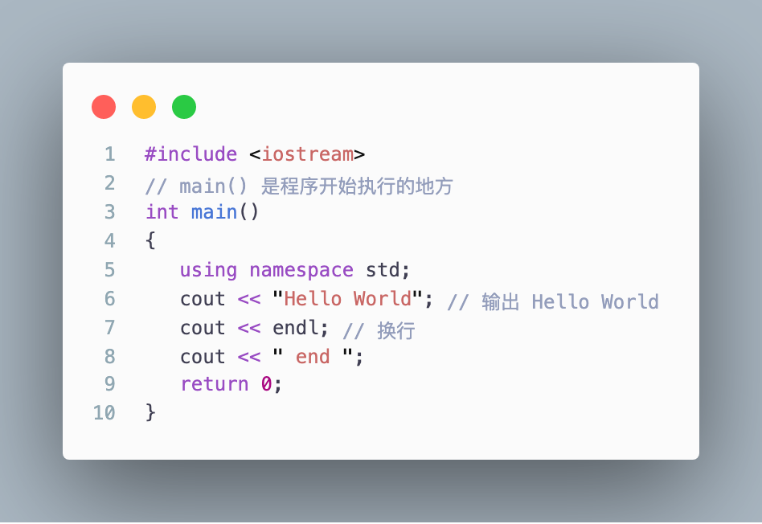
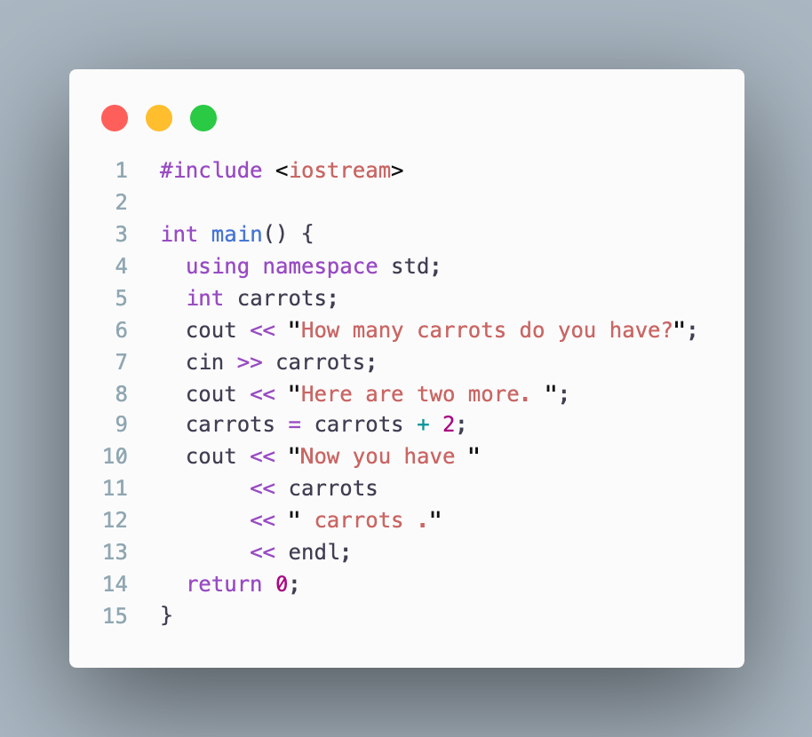
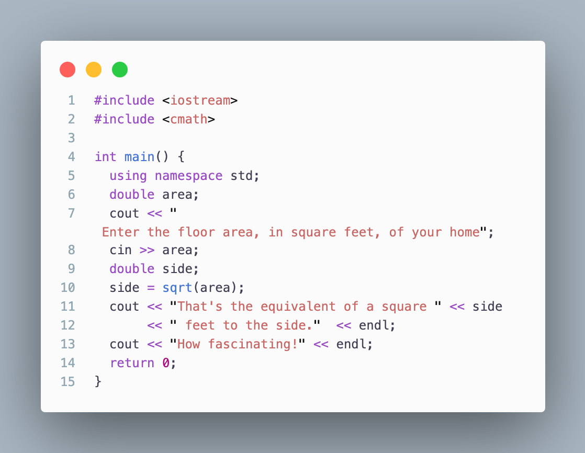
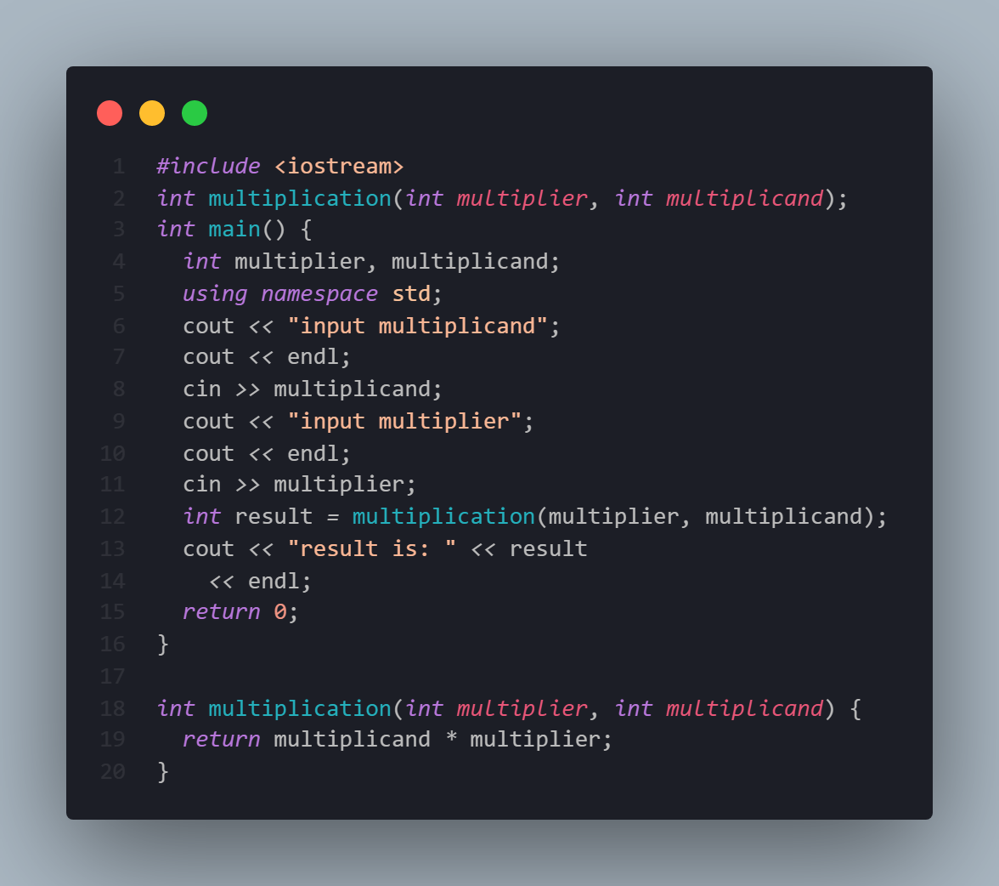

# Hello word

## main函数
```C++
int main(){}
```
- main
  main 函数是入口函数、在运行`C++`时程序通常从`main()`开始照顾下。
  C++ 语法要求 `main()`函数的定义一函数头 `int main()` 开始

- int funcName:
  `int` 告诉我们函数返回值为`int`类型
- return 0;
  为什么 `main()`函数返回一个`int`值， 这个值返回到了哪里？
  > 答案是： 可以将计算机操作系统看作调用程序。因此。`main()`函数的返回值并不是返回给程序的其他部分，而是返回给操作系统。很多操作系统都可以使用程序的返回值（退出值）。 通常的约定是: 退出值为 `0` 表示程序运行成功，为非 `0` 则意味着存在问题。
## C++预处理器和 iostream 文件
```C++
#include <iostream>
using namespace std;
```

  C++ 使用一个预处理器，该程序在进行主编译之前对源文件进行处理。不需要使用任何特殊的操作来调用改预处理器，它会在编译时**自动运行**

### `#include <iostream>`

  该编译指令会导致预处理器,将 `iostream` 文件的内容添加到程序中。这是一种典型的预处理器操作： 在源代码被编译之前，替换或添加文本。

### 头文件名
  像 `iostream`这样的文件叫做包含文件，由于他们被包含在其他文件中；也叫头文件(由于他们被包含在文件其实处)

| 头文件风格       | 约定     | 示例       | 说明              |
| ---------------- | -------- | ---------- | ----------------- |
| C++ 旧式文件风格 | 以.h结尾 | `iostream.h` | `C++` 程序可以使用   |
| C 旧式文件风格   | 以.h结尾 | `math.h`     | `C/C++` 程序可以使用 |
| C++ 新式文件风格 | 没有扩展名 | `iostream` | `C++` 程序可以使用，使用`namespace std`   |
| 转换之后的 C | 加上前缀 c，没有扩展名 | `cmath` | `C++` 程序可以使用，可以使用不是 `c` 的特性。 如 `namespace std` |

### 名称空间 `using namespace `
``` C++
using namespace std;
```

  命名空间使我们能够将命名的实体分组，否则它们将具有全局作用域，成为较窄的作用域，从而为它们提供命名空间scope。这允许将程序的元素组织到名称所指的不同逻辑范围内。
- 命名空间是C ++中添加的功能，在C中不存在。
- 命名空间是一个声明性区域，它为其中的标识符（类型的名称，函数，变量等）提供范围。
- 允许使用多个具有相同名称的名称空间块。这些块中的所有声明都在命名范围中声明。

``` C++
namespace namespace_name 
{
   int x, y; // code declarations where 
             // x and y are declared in 
             // namespace_name's scope
}
```
##  `cout: ` `<<` 输入运算符 || `cin: ` `>>` 插入运算符
### `cout`
    << 将右侧的信息发送给 `cout` 这个对
``` C++
cout << string
```

### `cin`
      cin 使用 `>>` 运算符从输入流中抽取字符。 通常在运算符右侧需要提供一个变量，以接收抽取的信息

```C++
cin >> carrots;
```
## `C++` 语句
### 声明语句和变量
``` C++
int carrots;
```
> 声明一个名称为 `carrots`  并且类型为 `int `的变量。

###  赋值语句
``` C++
carrots = 25;
```
> `carrots` 将整数 `25` 赋值给变量 `carrots` 表示的内存单元；

      = 叫做赋值运算符

``` C++
int steinway;
int baldwin;
int yamaha;
yamaha = baldwin = steinway = 88;
```
赋值是从右到左进行。首先。 88 被赋值给 `steinway`; 然后， `steinway` 的值被赋值给 `baldwin` 、 然后 `baldwin` 被赋值给 `yamaha`

## 使用`cin` 作为程序输入


``` C++
  int carrots;
  cout << "How many carrots do you have?";
  cin >> carrots;
```
> 将 从`cin` 获取的值 赋值给变量`carrots` 的内存单元

## 函数
C++ 函数分为2种

- 有返回值
- 每有返回值

### 函数格式
```
type functionName(argumentList) {
  statements
}
```
#### 函数原型
    函数原型（函数声明）就是告诉编译器这个函数是存在的，让编译器知道这个函数的相关信息。函数原型不要求提供形参名，有类型列表就可以了。避免使用函数原型的方法是，在首次使用函数定义之前定义它
#### 函数头
```
type functionName(type argumentName)
```

- 如果type为`void`表明函数是没有返回值的


### 有返回值函数


# 函数指针
    函数指针指向的是一个函数的指针地址，每一个函数都会占用一段连续的内存空间
## 定义方式
    类型名称(* 变量名称)(参数类型1， 参数类型2.。。)
e.g: 
```C++
int (*functionName)(int,char)
```
> 定一个函数指针名称为`functionName` 且返回值为`int`类型， 并且含有2个参数， 1：`int`类型 、2: `char`类型
## 使用方式
