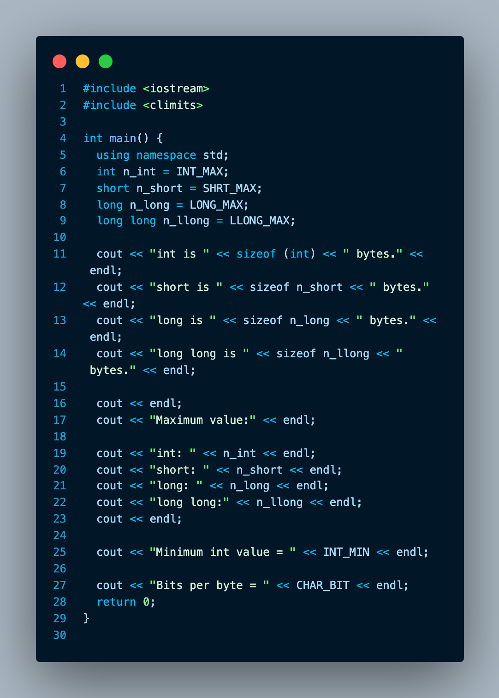

# 处理数据
  * C++ 变量命名规则
  * C++ 内置的整型
  * C++11新增的整型
  * 表示各种整型的系统限制的 climits 文件
  * 各种整型的数字字面值
  * 使用const限定符来创建符号常量
  * C++ 内置的浮点类型
  * 表示各种浮点类型的系统限制的cfloat文件
  * 各种浮点类型的数字字面值
  * C++的算术运算符
  * 自动类型转换
  * 强制类型转换

    面向对象的本质是 **设计并且扩展自己的数据类型**。 设计自己的数据类型就是让类型与数据匹配
  
内置的`C++` 类型分为两组
1. 基本类型： 整数和浮点数
2. 复合类型： 数组、字符串、指针 和 结构

### 简单变量
```C++
int braincount;
braincount = 5;
```
> 这段代码告诉程序， `int` 存储一个整数， `braincount` 变量名为`braincount` 来表示该整数的值。
实际上为： 程序找到一块能够存储整数的内存， 并且标记该内存单元为`braincount`。 并将 `5` 复制到该内存单元中。

#### 变量名
* 变量名必须具有某种含义
* 在名称中只能使用 **字母字符** 、 **数字** 和 **下划线(_)**
* 名称的第一个字符不能是数字
* 区分大小写字符
* 不能将C++的关键字作为名称
* 以两个下划线或下划线和大写字母打头的名称被保留给实现（编译器及其使用的资源）使用， 以一个下环线开头的名称被保留给实现，用作全句的标示符
* C++ 对于名称的长度没有限制，名称中的所有字符都有意义。

#### 整型
  整数就是没有小数部分的数字，不同C++整型使用不同的内存量来存储整数.  
使用的内存量越大，可以表示整数值的范围也越大。

#### short、 int 、long 、 和 long long

* `short` 最少16位
* `int` 至少与`short`一样长
* `long` 至少 32 位， 且至少与`int`一样长
* `long long` 至少64位， 且至少与`long`一样长

  
- 运行结果
    ```
    int is 4 bytes.
    short is 2 bytes.
    long is 8 bytes.
    long long is 8 bytes.
    
    Maximum value:
    int: 2147483647
    short: 32767
    long: 9223372036854775807
    long long:9223372036854775807
    
    Minimum int value = -2147483648
    Bits per byte = 8
    ```

1. 运算符 `sizeof` 和头文件 `climits`
`sizeof` 运算符： 对类型名(int)使用`sizeof`运算符时，应将名称放在括号中， 但是对变量名使用时，括号是可选的。
头文件`climits` 定义了符号常量来表示类型的限制。

- climits中的符号常量

  | 符号常量   | 表示                        |
  | ---------- | --------------------------- |
  | CHAR_BIT   | char 的位数                 |
  | CHAR_MAX   | char 的最大值               |
  | CHAR_MIN   | char 的最小值               |
  | SCHAR_MAX  | signed char 的最大值        |
  | SCHAR_MIN  | signed char 的最小值        |
  | UCHAR_MAX  | unsigned char 的最大值      |
  | SHRT_MIN   | short 的最小值              |
  | SHRT_MAX   | short 的最大值              |
  | USHRT_MAX  | unsigned short 的最大值     |
  | INT_MAX    | int 的最大值                |
  | INT_MIN    | int 的最小值                |
  | UNIT_MAX   | unsigned int 的最大值       |
  | LONG_MAX   | long 的最大值               |
  | LONG_MIN   | long 的最小值               |
  | ULONG_MAX  | unsigned long 的最大值      |
  | LLONG_MAX  | long long 的最大值          |
  | LLONG_MIN  | long long 的最小值          |
  | ULLONG_MAX | unsigned long long 的最大值 |